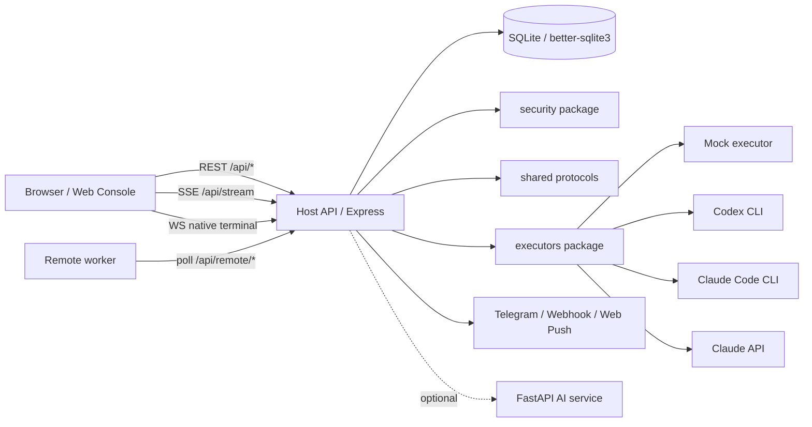

# Remote Agent Console

Language: [Simplified Chinese](README.md) | English

> [!IMPORTANT]
> **Public Preview / WIP Alpha**
>
> RAC is still a work in progress. It is mainly intended for local development, feature validation, and small-scope trials. APIs, data structures, deployment practices, and UI behavior may continue to change.
>
> The project has not completed formal online-environment validation, long-running operation tests, failure-recovery drills, or public-internet security review. It is not recommended for production use. For trials, prefer the Mock executor or a controlled disposable workspace, and do not point real executors at directories containing production secrets, private data, or files that cannot be discarded.

Remote Agent Console (RAC) is a single-user personal cloud/local Agent Workbench for managing local or remote coding agents from a web console. It combines the Host service, React console, SQLite persistence, security boundaries, and a unified executor interface in one pnpm workspace. It is intended for running Codex CLI, Claude Code CLI, Claude API, or the Mock executor inside controlled workspaces, while visualizing execution through realtime streams, approvals, diffs, notifications, and audit records.

RAC is currently positioned as a single-user personal execution platform. A cloud Host/Web console can schedule trusted remote workers, but RAC is not a multi-tenant SaaS platform and should not be exposed directly as an unbounded public execution service without TLS, authentication, and workspace boundaries.

## Project Status

> Status: WIP / Alpha. This project is still under active development, has not completed formal online testing, and is not recommended for production use.

This repository is mainly used for local development, feature validation, and future iteration records. The core workbench, executor integration, permission boundaries, notifications, and basic test flow are already present, but APIs, data structures, deployment practices, and UI details may still change frequently.

For trial use, prefer the Mock executor or a controlled local workspace. Do not point real executors at directories that contain sensitive files, production secrets, or data that cannot be discarded. The deployment section in this document describes production-readiness preparation, not proof that the project has been validated in public online environments, long-running operation, or full failure-recovery scenarios.

This directory is the pnpm workspace root. Run installation, startup, test, and deployment commands from this directory.

## Choose Your Path

| Goal                              | Start here                                                                                          |
| --------------------------------- | --------------------------------------------------------------------------------------------------- |
| Understand the current stage      | Read [Project Status](#project-status), [Known Limitations](#known-limitations), and `CHANGELOG.md` |
| Run locally for the first time    | Read [Requirements](#requirements) and [Quick Start](#quick-start)                                  |
| Start backend and frontend apart  | Read [Manual Development Startup](#manual-development-startup)                                      |
| Configure Codex or Claude         | Read [Real Executors](#real-executors)                                                              |
| Prepare a production deployment   | Read [Deployment](#deployment), then `docs/deployment-guide.md`                                     |
| Inspect APIs and realtime streams | Read [API Entry Points](#api-entry-points), then `docs/api.md`                                      |
| Run validation, CI, or E2E        | Read [Tests And Quality Gates](#tests-and-quality-gates)                                            |
| Troubleshoot startup or providers | Read [FAQ](#faq)                                                                                    |
| Understand architecture and docs  | Read [System Architecture](#system-architecture) and `docs/README.en.md`                            |

## Core Capabilities

- Web console: login, device management, Agent Workbench, task history, templates, configuration, and notification settings.
- Agent Workbench: conversational interaction, plan updates, tool-call cards, approval cards, diff review, model switching, interruption, and resume.
- Host API: Express API, SSE realtime streams, WebSocket terminal, SQLite persistence, login authentication, CSRF protection, and restart recovery.
- Executors: built-in Mock executor, Codex CLI, Claude Code CLI, and Claude API support. There is currently no usable Cursor executor.
- Security: workspace boundaries, risky command detection, approval timeouts, log redaction, login rate limits, session baselines, safe discard, remote worker credentials, and security audit records.
- Notifications: Telegram, Webhook, and Web Push for approval reminders and task status updates.
- Remote device mode: the Host can act as the control plane and exposes polling endpoints for remote workers.
- Optional AI service: `apps/ai-service` provides helper APIs for RAG indexing, evaluation, and failure analysis.

## System Architecture



## Tech Stack

- Node.js + TypeScript
- pnpm workspace
- Express
- React + Vite
- SQLite + `better-sqlite3`
- Playwright
- Optional FastAPI AI service

## Repository Layout

```text
apps/
  host/        # Local Host/API service and remote worker
  web/         # React Web console
  ai-service/  # Optional FastAPI AI service
packages/
  shared/      # Shared types, protocols, constants, and executor interfaces
  storage/     # SQLite schema and repositories
  security/    # Auth, risk detection, path limits, and log redaction
  executors/   # mock, codex, claude, claude-code, and cursor executor adapters
docs/          # Architecture, API, Workbench, deployment, and security docs
scripts/       # Startup, setup, backup, health check, and test scripts
tests/         # Integration test entry points
e2e/           # Playwright E2E tests
data/          # Default local data directory
```

## Requirements

- Node.js 18 or later. CI currently uses Node.js 22.
- pnpm 10.11.1 or later. Corepack is recommended: `corepack enable`.
- Git. Workbench uses it to create session baselines, generate diffs, and perform safe discard.
- Windows PowerShell or a POSIX shell. Current project scripts prioritize PowerShell.
- For real executors: install the `codex` CLI or `claude` CLI and ensure the command is available in `PATH`.
- For the AI service: install Python and `uv`.

## Quick Start

Install dependencies and build Host dependencies for the first time:

```powershell
corepack enable
corepack pnpm run setup
```

Start Host and Web:

```powershell
corepack pnpm start
```

`start` opens separate PowerShell windows for Host and Web. For development, the single-window mode is often more convenient:

```powershell
corepack pnpm dev
```

Default URLs:

- Web Console: `http://localhost:5173`
- Host API: `http://localhost:3001`
- Health Check: `http://localhost:3001/api/health`

If `5173` is already in use, the startup script prints an alternative Web port. The default username is `admin`. If `.env` is not configured, Host prints a temporary development password in the startup logs. If you copy `.env.example`, change `ADMIN_PASSWORD`, `JWT_SECRET`, and `PROVIDER_SECRET_KEY` first.

After opening the console for the first time, trust the local device on the Devices page, then open `/workbench` to create a real task or session.

## Manual Development Startup

To start backend and frontend separately:

```powershell
corepack pnpm build:packages
corepack pnpm build:host
corepack pnpm dev:host
```

Start Web in another terminal:

```powershell
corepack pnpm dev:web
```

Optional AI service:

```powershell
corepack pnpm dev:ai
```

Equivalent Python command:

```powershell
python -m uv run --project apps/ai-service uvicorn app.main:app --host 127.0.0.1 --port 8010
```

## Configuration

For first-time local development, copy the example configuration:

```powershell
Copy-Item .env.example .env
```

Host runtime configuration, the console configuration page, and first-login persistence all use the `.env` file at the repository root. Do not deploy `apps/.env`.

The minimal local configuration usually requires checking these values:

| Variable                                        | Description                                                                                  |
| ----------------------------------------------- | -------------------------------------------------------------------------------------------- |
| `HOST_PORT` / `HOST_HOSTNAME`                   | Host bind address. Defaults to `127.0.0.1:3001`                                              |
| `PUBLIC_BASE_URL`                               | External Host URL. Usually `http://127.0.0.1:3001` locally                                   |
| `CORS_ORIGINS`                                  | Allowed Web origins for Host access                                                          |
| `ADMIN_USERNAME` / `ADMIN_PASSWORD`             | Console login credentials                                                                    |
| `JWT_SECRET` / `PROVIDER_SECRET_KEY`            | Secrets for login tokens and provider key encryption                                         |
| `DB_PATH`                                       | SQLite database path. Defaults to `./data/rac.db`                                            |
| `ALLOWED_WORK_DIR`                              | Root path allowed for tasks and sessions                                                     |
| `RAC_REMOTE_ALLOWED_WORK_DIR`                   | Controlled root path for remote workers. Falls back to `ALLOWED_WORK_DIR` when unset         |
| `RAC_REMOTE_HEARTBEAT_INTERVAL_MS`              | Remote worker heartbeat/claim interval. Defaults to `3000`ms                                 |
| `RAC_REMOTE_MAX_RECONNECT_DELAY_MS`             | Maximum reconnect backoff for the remote worker WebSocket bridge. Defaults to `30000`ms      |
| `RAC_REMOTE_BRIDGE_PING_INTERVAL_MS`            | Host ping interval for the remote worker bridge. Defaults to `15000`ms                       |
| `VITE_API_URL` / `VITE_SSE_URL` / `VITE_WS_URL` | Frontend URLs for Host, SSE, and WebSocket. These must be set before building the Web bundle |

Production or HTTPS deployment must additionally confirm:

- `NODE_ENV=production`
- `REQUIRE_HTTPS=true`
- `TRUST_PROXY=true`, when Host is behind a trusted HTTPS reverse proxy.
- `PUBLIC_BASE_URL`, `CORS_ORIGINS`, `VITE_API_URL`, `VITE_SSE_URL`, and `VITE_WS_URL` use public HTTPS/WSS URLs.
- `AGENT_SECURITY_PROFILE=strict`
- `ADMIN_PASSWORD`, `JWT_SECRET`, `PROVIDER_SECRET_KEY`, and `REMOTE_REGISTRATION_TOKEN` are replaced with strong random values.
- `AUTH_COOKIE_SECURE=true`
- `ALLOW_QUERY_TOKEN_AUTH=false`
- `CODEX_FULL_AUTO=false`
- `CLAUDE_CODE_SKIP_PERMISSIONS=false`

`.env.example` and `.env.production.example` only document fields. Do not commit real secrets.

## Real Executors

RAC can use different executors in the same Workbench UI. Provider availability depends on `.env`, local CLI installation, authentication state, and `PATH`.

| Executor        | Purpose                       | Key configuration                                                          |
| --------------- | ----------------------------- | -------------------------------------------------------------------------- |
| Mock            | Local smoke and UI validation | Built in, no external CLI required                                         |
| Codex CLI       | Local Codex sessions          | `CODEX_ENABLED`, `CODEX_COMMAND`, `CODEX_MODEL`, optional `OPENAI_API_KEY` |
| Claude Code CLI | Local Claude Code sessions    | `CLAUDE_CODE_ENABLED`, `CLAUDE_CODE_COMMAND`, `CLAUDE_CODE_MODEL`          |
| Claude API      | SDK/API execution entry point | `CLAUDE_API_KEY`, `CLAUDE_MODEL`, `CLAUDE_MAX_TOKENS`                      |

Before configuring real executors, verify that the CLI runs and is logged in from a normal terminal:

```powershell
codex --version
claude --version
```

`CLAUDE_CODE_SKIP_PERMISSIONS` should only be enabled temporarily in trusted, disposable development workspaces. It must stay `false` under `AGENT_SECURITY_PROFILE=strict`. `CODEX_FULL_AUTO` must also stay `false` under the strict profile.

Real Codex / Claude Code provider smoke tests are skipped by default. Enable them only after confirming that the local CLI is logged in and you are willing to run a real provider in a temporary git repository:

```powershell
$env:REAL_PROVIDER_SMOKE = '1'
corepack pnpm test:real-provider-smoke
```

## Agent Workbench

The Workbench entry point is `/workbench`. Legacy `/tasks/new` and `/task/new` routes redirect to the same page.

The workbench supports:

- Selecting a device, executor, model, and workspace directory.
- Continuous sessions, history resume, and streaming messages.
- Remote TUI terminal for Shell, Codex, and Claude Code. Shell terminal startup is authorized through Workbench permission rules.
- Slash commands including `/help`, `/new`, `/clear`, `/rename`, `/resume`, `/model`, `/models`, `/effort`, `/status`, `/review`, `/diff`, `/discard`, `/permissions`, `/compact`, `/export`, `/native`, `/codex`, `/claude`, `/plan`, and `/stop`.
- Realtime updates for approvals, tool calls, diffs, plan summaries, and execution status.
- Session-level model switching. Host passes the effective model ID to the underlying executor.

See `docs/agent-workbench.md` for more behavior details.

## Tests And Quality Gates

| Command                            | Purpose                                           |
| ---------------------------------- | ------------------------------------------------- |
| `corepack pnpm verify:mvp`         | Build packages, Host, and Web                     |
| `corepack pnpm lint`               | ESLint check, allowing up to 5 warnings           |
| `corepack pnpm lint:strict`        | Strict ESLint check with no warnings allowed      |
| `corepack pnpm format:check`       | Prettier format check                             |
| `corepack pnpm test:integration`   | Integration tests                                 |
| `corepack pnpm test:e2e:workbench` | Workbench Playwright E2E tests                    |
| `corepack pnpm verify:workbench`   | Build, integration tests, and Workbench E2E       |
| `corepack pnpm run ci`             | Local release gate, aligned with the main CI flow |
| `corepack pnpm test:ai`            | Optional AI service tests, requiring Python/uv    |

CI is defined in `.github/workflows/ci.yml`. It installs dependencies, runs production dependency security audit, installs Playwright Chromium, and runs `corepack pnpm run ci`.

These commands improve local and CI confidence, but the repository has not yet completed validation for real online environments, long-running operation, or failure-recovery drills.

## Deployment

> Note: this section describes production-readiness preparation, not a completed online validation report. The project is still WIP / Alpha. Before exposing it publicly, perform additional security review, environment isolation, backup/restore drills, and real traffic validation.

Recommended production deployment:

- Host listens only on `127.0.0.1:3001`.
- Web is built as static files with `corepack pnpm build:web`.
- Nginx or Caddy handles TLS termination, static file serving, and `/api/*` reverse proxying.
- Production `.env` is copied from `.env.production.example`, with all `<CHANGE_ME_*>` placeholders replaced.
- `VITE_API_URL`, `VITE_SSE_URL`, and `VITE_WS_URL` must be configured before building Web because they are written into the frontend bundle.
- For first-time remote worker registration, set `RAC_REMOTE_REGISTRATION_TOKEN` and `RAC_REMOTE_ALLOWED_WORK_DIR`. After registration succeeds, save the one-time `RAC_REMOTE_DEVICE_ID` and `RAC_REMOTE_DEVICE_TOKEN`. A worker must report an available work root before it can claim real tasks.

See `docs/deployment-guide.md` for deployment steps, `docs/production-deployment.md` for the production runbook, and `docs/security.md` for security boundaries.

## API Entry Points

Host exposes REST, SSE, and WebSocket interfaces. Common entry points include:

- `GET /api/health`
- `/api/auth`
- `/api/devices`
- `/api/agent`
- `/api/tasks`
- `/api/sessions`
- `/api/runs`
- `/api/models`
- `/api/providers`
- `/api/approvals`
- `/api/stream`
- `/api/config`
- `/api/remote`

See `docs/api.md` for more interfaces, request/response details, and realtime stream behavior.

## Common Scripts

| Command                        | Purpose                                        |
| ------------------------------ | ---------------------------------------------- |
| `corepack pnpm run setup`      | Install dependencies and build packages + Host |
| `corepack pnpm start`          | Start Host and Web in separate windows         |
| `corepack pnpm dev`            | Start Host and Web in one window               |
| `corepack pnpm dev:host`       | Start Host development service                 |
| `corepack pnpm dev:web`        | Start Web development service                  |
| `corepack pnpm dev:ai`         | Start the optional AI service                  |
| `corepack pnpm build`          | Build all workspace packages                   |
| `corepack pnpm build:packages` | Build shared packages                          |
| `corepack pnpm build:host`     | Build Host                                     |
| `corepack pnpm build:web`      | Build Web                                      |
| `corepack pnpm db:backup`      | Back up the SQLite database                    |
| `corepack pnpm health:check`   | Check `/api/health`                            |
| `corepack pnpm setup:telegram` | Configure Telegram notifications               |
| `corepack pnpm test:ai`        | Run optional AI service tests                  |
| `corepack pnpm load:test`      | Run the load test script                       |
| `corepack pnpm clean`          | Run workspace clean                            |

## FAQ

**pnpm is not found**

Run `corepack enable` first. If the environment does not support Corepack, install pnpm 10.11.1 or later with your local Node.js management approach.

**First startup says setup is required**

Run this from the repository root:

```powershell
corepack pnpm run setup
```

**Web port is already in use**

`start` and `dev` automatically choose an alternative Web port and print it. To pin Host or frontend URLs, adjust `HOST_PORT`, `VITE_API_URL`, `VITE_SSE_URL`, and `VITE_WS_URL` in `.env`.

**Login cookie is not sent**

For local development, keep `REQUIRE_HTTPS=false` and `AUTH_COOKIE_SECURE=false`, and ensure `PUBLIC_BASE_URL`, `VITE_API_URL`, and the browser URL match each other.

**Cannot run real tasks after login**

Host automatically registers the local device on first run. Trust the local device on the Devices page, then return to `/workbench` to create a real task or session.

**Codex or Claude provider is unavailable**

Check that `CODEX_COMMAND` or `CLAUDE_CODE_COMMAND` is executable from `PATH`, and confirm the CLI is logged in. Restart Host after modifying `.env`.

**Workbench reports a dirty worktree**

This is expected when there are existing uncommitted changes. The session baseline protects the pre-session state, and safe discard should only handle changes produced by the session.

**Real provider smoke is skipped**

This is the default behavior. `test:real-provider-smoke` only runs real Codex / Claude Code providers after `$env:REAL_PROVIDER_SMOKE = '1'` is set.

## Related Docs

- `docs/README.en.md`: English documentation index.
- `docs/README.md`: Chinese documentation index and current source of truth.
- `docs/architecture.md`: Current architecture.
- `docs/api.md`: API reference.
- `docs/security.md`: Security boundaries and deployment notes.
- `docs/deployment-guide.md`: Chinese deployment guide.
- `docs/production-deployment.md`: Production deployment runbook.
- `docs/agent-workbench.md`: Workbench behavior and session capabilities.
- `docs/agent-workbench-acceptance.md`: Manual Workbench acceptance scenarios.
- `docs/claude-code-workbench-quickstart.md`: Detailed guide for starting Workbench after a fresh clone.
- `docs/documentation-guide.en.md`: Bilingual documentation maintenance rules.
- `docs/roadmap.en.md`: English roadmap.
- `CHANGELOG.en.md`: English changelog for public repository updates.

## Known Limitations

- The project is still WIP / Alpha and has not completed real online deployment testing, long-running validation, or failure-recovery drills.
- It is positioned as a single-user personal cloud/local execution platform, not a multi-tenant cloud platform.
- strict/production mode requires controlled workspace configuration and forbids `ALLOW_QUERY_TOKEN_AUTH=true`. Do not point real executors at broad directories containing sensitive files.
- Remote workers must report `workRoot` with `workRootExists=true`. Tasks and remote terminals are ultimately path-checked by the worker against its local controlled work root.
- Claude Code and Codex availability depends on local CLI installation, authentication, and `PATH` configuration.
- There is currently no usable Cursor executor. Real Cursor background agent integration remains a future roadmap item.
- Some advanced diff UI and mobile-specific interactions are still evolving.
