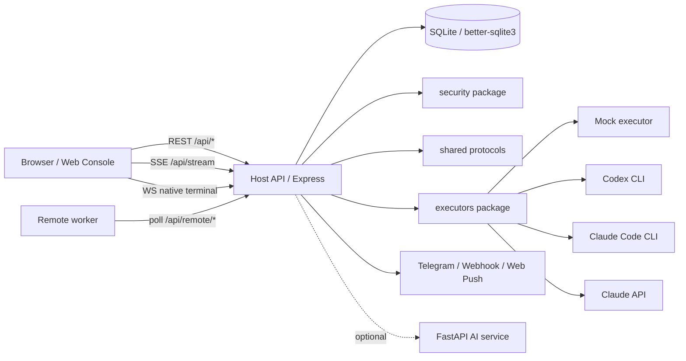

# Remote Agent Console

语言：简体中文 | [English](README.en.md)

> [!IMPORTANT]
> **公开预览 / WIP Alpha**
>
> RAC 目前仍是半成品，主要用于本地开发、功能验证和小范围试用；接口、数据结构、部署方式和交互细节都可能继续调整。它尚未完成正式线上环境、长期运行、故障恢复和公网安全验证，不建议直接用于生产环境。
>
> 试用时请优先使用 Mock 执行器或受控的临时工作区，不要把真实执行器指向包含生产密钥、隐私数据或不可丢弃文件的目录。本文档中的部署内容是生产化准备说明，不代表项目已经具备生产可用保证。

Remote Agent Console（RAC）是一个单用户个人云端/本地 Agent Workbench，用 Web 控制台管理本机或远端编码代理。它把 Host 服务、React 控制台、SQLite 持久化、安全边界和统一执行器接口放在一个 pnpm workspace 中，适合在受控工作区里运行 Codex CLI、Claude Code CLI、Claude API 或 Mock 执行器，并通过实时流、审批、diff、通知和审计能力把执行过程可视化。

RAC 的当前定位是单用户个人执行平台：云端 Host/Web 控制台可以调度可信远端 worker，但它不是多租户 SaaS，也不应该绕过 TLS、认证和工作目录边界直接暴露为无边界公网执行服务。

## 项目状态

> 当前状态：WIP / Alpha。项目仍在开发中，尚未完成正式上线测试，不建议直接用于生产环境。

这个仓库目前主要用于本地开发、功能验证和后续迭代记录。核心工作台、执行器接入、权限边界、通知和基础测试链路已经具备雏形，但接口、数据结构、部署方式和交互细节仍可能频繁调整。

如果你只是想试用，建议优先使用 Mock 执行器或受控的本地工作区。不要把真实执行器指向包含敏感文件、生产密钥或不可丢弃数据的目录。本文档中的部署章节是生产化准备说明，不代表项目已经经过线上公网环境、长时间运行或多场景故障恢复验证。

当前目录就是 pnpm workspace 根目录。所有安装、启动、测试和部署命令都应在本目录执行。

## 选择你的路径

| 我想做什么           | 从这里开始                                                                        |
| -------------------- | --------------------------------------------------------------------------------- |
| 了解当前阶段         | 读 [项目状态](#项目状态)、[已知限制](#已知限制) 和 [`CHANGELOG.md`](CHANGELOG.md) |
| 第一次本地跑起来     | 读 [环境要求](#环境要求) 和 [快速启动](#快速启动)                                 |
| 分别启动前后端调试   | 读 [手动开发启动](#手动开发启动)                                                  |
| 配置 Codex 或 Claude | 读 [真实执行器](#真实执行器)                                                      |
| 准备生产部署         | 读 [部署](#部署)，再进入 [`docs/deployment-guide.md`](docs/deployment-guide.md)   |
| 查看接口和实时流     | 读 [API 入口](#api-入口)，再进入 [`docs/api.md`](docs/api.md)                     |
| 跑验证、CI 或 E2E    | 读 [测试与质量门禁](#测试与质量门禁)                                              |
| 排查启动或 provider  | 读 [常见问题](#常见问题)                                                          |
| 理解架构和文档全貌   | 读 [系统架构](#系统架构) 和 [`docs/README.md`](docs/README.md)                    |

## 核心能力

- Web 控制台：登录、设备管理、Agent Workbench、任务历史、模板、配置和通知设置。
- Agent Workbench：会话式交互、计划更新、工具调用卡片、审批卡片、diff review、模型切换、中断和恢复。
- Host API：Express API、SSE 实时流、WebSocket 终端、SQLite 持久化、登录鉴权、CSRF 防护和重启恢复。
- 执行器：内置 Mock 执行器，支持 Codex CLI、Claude Code CLI、Claude API；当前没有可用的 Cursor executor。
- 安全能力：工作目录边界、风险命令识别、审批超时、日志脱敏、登录限流、会话基线、安全丢弃、远端 worker 凭据和安全审计。
- 通知能力：Telegram、Webhook、Web Push，可用于审批提醒和任务状态通知。
- 远端设备模式：Host 可作为控制端，也提供 remote worker 轮询入口。
- 可选 AI 服务：`apps/ai-service` 提供 RAG 索引、评估和失败分析辅助接口。

## 系统架构



## 技术栈

- Node.js + TypeScript
- pnpm workspace
- Express
- React + Vite
- SQLite + `better-sqlite3`
- Playwright
- 可选 FastAPI AI service

## 目录结构

```text
apps/
  host/        # 本地 Host/API 服务与 remote worker
  web/         # React Web 控制台
  ai-service/  # 可选 FastAPI AI 服务
packages/
  shared/      # 共享类型、协议、常量和执行器接口
  storage/     # SQLite schema 与 repository
  security/    # 鉴权、风险识别、路径限制、日志脱敏
  executors/   # mock、codex、claude、claude-code、cursor 执行器适配
docs/          # 架构、API、Workbench、部署和安全文档
scripts/       # 启动、初始化、备份、健康检查和测试脚本
tests/         # 集成测试入口
e2e/           # Playwright E2E 测试
data/          # 默认本地数据目录
```

## 环境要求

- Node.js 18 或更高版本。CI 当前使用 Node.js 22。
- pnpm 10.11.1 或更高版本；推荐启用 Corepack：`corepack enable`。
- Git；Workbench 会用它建立会话基线、生成 diff 和做安全丢弃。
- Windows PowerShell 或 POSIX shell；当前项目脚本以 PowerShell 优先。
- 如需真实执行器：安装 `codex` CLI 或 `claude` CLI，并确保命令在 `PATH` 中。
- 如需 AI service：安装 Python 和 `uv`。

## 快速启动

首次安装依赖并构建 Host 依赖包：

```powershell
corepack enable
corepack pnpm run setup
```

启动 Host 和 Web：

```powershell
corepack pnpm start
```

`start` 会分别打开 Host 和 Web 两个 PowerShell 窗口。更适合开发调试的单窗口模式是：

```powershell
corepack pnpm dev
```

默认访问地址：

- Web Console: `http://localhost:5173`
- Host API: `http://localhost:3001`
- Health Check: `http://localhost:3001/api/health`

如果 `5173` 已被占用，启动脚本会打印替代 Web 端口。默认用户名是 `admin`。如果没有配置 `.env`，Host 会在启动日志中打印临时开发密码；如果复制了 `.env.example`，请先修改其中的 `ADMIN_PASSWORD`、`JWT_SECRET` 和 `PROVIDER_SECRET_KEY`。

首次进入控制台后，先在设备页信任本机设备，再进入 `/workbench` 创建真实任务或会话。

## 手动开发启动

如果希望分别启动后端和前端：

```powershell
corepack pnpm build:packages
corepack pnpm build:host
corepack pnpm dev:host
```

另开一个终端启动 Web：

```powershell
corepack pnpm dev:web
```

可选 AI service：

```powershell
corepack pnpm dev:ai
```

等价的 Python 命令是：

```powershell
python -m uv run --project apps/ai-service uvicorn app.main:app --host 127.0.0.1 --port 8010
```

## 配置指南

首次本地开发可以复制示例配置：

```powershell
Copy-Item .env.example .env
```

Host 运行时配置、控制台配置页和首次登录持久化都会使用仓库根目录的 `.env`。不要部署 `apps/.env`。

本地最小配置通常只需要确认这些值：

| 变量                                            | 说明                                                                    |
| ----------------------------------------------- | ----------------------------------------------------------------------- |
| `HOST_PORT` / `HOST_HOSTNAME`                   | Host 监听地址，默认 `127.0.0.1:3001`                                    |
| `PUBLIC_BASE_URL`                               | Host 对外地址，本地通常是 `http://127.0.0.1:3001`                       |
| `CORS_ORIGINS`                                  | 允许访问 Host 的 Web 来源                                               |
| `ADMIN_USERNAME` / `ADMIN_PASSWORD`             | 控制台登录账号                                                          |
| `JWT_SECRET` / `PROVIDER_SECRET_KEY`            | 登录 token 和 provider key 加密密钥                                     |
| `DB_PATH`                                       | SQLite 数据库路径，默认 `./data/rac.db`                                 |
| `ALLOWED_WORK_DIR`                              | 任务/会话允许访问的工作目录根路径                                       |
| `RAC_REMOTE_ALLOWED_WORK_DIR`                   | remote worker 本机受控工作目录根路径；未设置时回退到 `ALLOWED_WORK_DIR` |
| `RAC_REMOTE_HEARTBEAT_INTERVAL_MS`              | remote worker 心跳/claim 间隔，默认 `3000`ms                            |
| `RAC_REMOTE_MAX_RECONNECT_DELAY_MS`             | remote worker WebSocket bridge 最大重连退避，默认 `30000`ms             |
| `RAC_REMOTE_BRIDGE_PING_INTERVAL_MS`            | Host 对 remote worker bridge 的 ping 间隔，默认 `15000`ms               |
| `VITE_API_URL` / `VITE_SSE_URL` / `VITE_WS_URL` | 前端访问 Host、SSE 和 WebSocket 的地址；构建 Web 前必须设置             |

生产或 HTTPS 部署必须额外确认：

- `NODE_ENV=production`
- `REQUIRE_HTTPS=true`
- `TRUST_PROXY=true`，前提是 Host 位于可信 HTTPS 反向代理后。
- `PUBLIC_BASE_URL`、`CORS_ORIGINS`、`VITE_API_URL`、`VITE_SSE_URL`、`VITE_WS_URL` 使用公网 HTTPS/WSS 地址。
- `AGENT_SECURITY_PROFILE=strict`
- `ADMIN_PASSWORD`、`JWT_SECRET`、`PROVIDER_SECRET_KEY`、`REMOTE_REGISTRATION_TOKEN` 替换为强随机值。
- `AUTH_COOKIE_SECURE=true`
- `ALLOW_QUERY_TOKEN_AUTH=false`
- `CODEX_FULL_AUTO=false`
- `CLAUDE_CODE_SKIP_PERMISSIONS=false`

`.env.example` 和 `.env.production.example` 只用于展示字段，不要把真实密钥提交到仓库。

## 真实执行器

RAC 可以在同一套 Workbench UI 中使用不同执行器。Provider 是否可用取决于 `.env`、本机 CLI、认证状态和 `PATH`。

| 执行器          | 用途                  | 关键配置                                                               |
| --------------- | --------------------- | ---------------------------------------------------------------------- |
| Mock            | 本地 smoke 和 UI 验证 | 内置可用，不依赖外部 CLI                                               |
| Codex CLI       | 本机 Codex 会话       | `CODEX_ENABLED`、`CODEX_COMMAND`、`CODEX_MODEL`、可选 `OPENAI_API_KEY` |
| Claude Code CLI | 本机 Claude Code      | `CLAUDE_CODE_ENABLED`、`CLAUDE_CODE_COMMAND`、`CLAUDE_CODE_MODEL`      |
| Claude API      | SDK/API 执行入口      | `CLAUDE_API_KEY`、`CLAUDE_MODEL`、`CLAUDE_MAX_TOKENS`                  |

配置真实执行器前，先在普通终端确认 CLI 可运行并已登录：

```powershell
codex --version
claude --version
```

`CLAUDE_CODE_SKIP_PERMISSIONS` 只应在可信、可丢弃的开发工作区中临时开启；`AGENT_SECURITY_PROFILE=strict` 下必须保持 `false`。`CODEX_FULL_AUTO` 在 strict profile 下也必须保持 `false`。

真实 Codex / Claude Code provider smoke 默认跳过。确认本机 CLI 已登录，并愿意在临时 git 仓库中运行真实 provider 后再开启：

```powershell
$env:REAL_PROVIDER_SMOKE = '1'
corepack pnpm test:real-provider-smoke
```

## Agent Workbench

Workbench 入口是 `/workbench`，旧的 `/tasks/new` 和 `/task/new` 会重定向到同一页面。

工作台支持：

- 选择设备、执行器、模型和工作目录。
- 连续会话、历史恢复和消息流式展示。
- Remote TUI 终端：支持 Shell、Codex 和 Claude Code；Shell 终端启动前会走 Workbench permission rules 授权。
- `/help`、`/new`、`/clear`、`/rename`、`/resume`、`/model`、`/models`、`/effort`、`/status`、`/review`、`/diff`、`/discard`、`/permissions`、`/compact`、`/export`、`/native`、`/codex`、`/claude`、`/plan`、`/stop` 等 slash commands。
- 审批请求、工具调用、diff、计划摘要和执行状态的实时更新。
- 会话级模型切换，Host 会把有效模型 ID 传给底层执行器。

更多行为说明见 [`docs/agent-workbench.md`](docs/agent-workbench.md)。

## 测试与质量门禁

| 命令                               | 用途                                 |
| ---------------------------------- | ------------------------------------ |
| `corepack pnpm verify:mvp`         | 构建 packages、Host 和 Web           |
| `corepack pnpm lint`               | ESLint 检查，最多允许 5 个 warning   |
| `corepack pnpm lint:strict`        | ESLint 严格检查，不允许 warning      |
| `corepack pnpm format:check`       | Prettier 格式检查                    |
| `corepack pnpm test:integration`   | 集成测试                             |
| `corepack pnpm test:e2e:workbench` | Workbench Playwright E2E 测试        |
| `corepack pnpm verify:workbench`   | 构建、集成测试和 Workbench E2E       |
| `corepack pnpm run ci`             | 本地 release gate，与 CI 主流程一致  |
| `corepack pnpm test:ai`            | 可选 AI service 测试，需要 Python/uv |

CI 位于 [`.github/workflows/ci.yml`](.github/workflows/ci.yml)，会安装依赖、执行生产依赖安全审计、安装 Playwright Chromium，并运行 `corepack pnpm run ci`。

这些命令用于提高本地和 CI 的发布信心，但当前仓库还没有完成真实线上环境、长期运行和故障恢复演练验证。

## 部署

> 注意：本节是生产化部署准备说明，不是已上线验证报告。当前项目仍处于 WIP / Alpha 阶段，正式暴露到公网前需要额外完成安全复核、环境隔离、备份恢复演练和真实流量验证。

生产部署建议：

- Host 只监听 `127.0.0.1:3001`。
- Web 通过 `corepack pnpm build:web` 构建为静态文件。
- Nginx 或 Caddy 负责 TLS 终止、静态文件服务和 `/api/*` 反向代理。
- 生产 `.env` 从 `.env.production.example` 复制，并替换所有 `<CHANGE_ME_*>` 占位值。
- `VITE_API_URL`、`VITE_SSE_URL`、`VITE_WS_URL` 必须在构建 Web 前配置，因为它们会写入前端 bundle。
- 远端 worker 首次注册时设置 `RAC_REMOTE_REGISTRATION_TOKEN` 和 `RAC_REMOTE_ALLOWED_WORK_DIR`；注册成功后保存一次性返回的 `RAC_REMOTE_DEVICE_ID` 和 `RAC_REMOTE_DEVICE_TOKEN`。worker 必须上报可用工作根目录后才能 claim 真实任务。

部署教程见 [`docs/deployment-guide.md`](docs/deployment-guide.md)。生产运维检查清单见 [`docs/production-deployment.md`](docs/production-deployment.md)。安全边界见 [`docs/security.md`](docs/security.md)。

## API 入口

Host 暴露 REST、SSE 和 WebSocket 接口。常用入口包括：

- `GET /api/health`
- `/api/auth`
- `/api/devices`
- `/api/agent`
- `/api/tasks`
- `/api/sessions`
- `/api/runs`
- `/api/models`
- `/api/providers`
- `/api/approvals`
- `/api/stream`
- `/api/config`
- `/api/remote`

更多接口、请求响应和实时流行为见 [`docs/api.md`](docs/api.md)。

## 常用脚本

| 命令                           | 用途                           |
| ------------------------------ | ------------------------------ |
| `corepack pnpm run setup`      | 安装依赖并构建 packages + Host |
| `corepack pnpm start`          | 分窗口启动 Host 和 Web         |
| `corepack pnpm dev`            | 单窗口启动 Host 和 Web         |
| `corepack pnpm dev:host`       | 启动 Host 开发服务             |
| `corepack pnpm dev:web`        | 启动 Web 开发服务              |
| `corepack pnpm dev:ai`         | 启动可选 AI service            |
| `corepack pnpm build`          | 构建全部 workspace 包          |
| `corepack pnpm build:packages` | 构建共享 packages              |
| `corepack pnpm build:host`     | 构建 Host                      |
| `corepack pnpm build:web`      | 构建 Web                       |
| `corepack pnpm db:backup`      | 备份 SQLite 数据库             |
| `corepack pnpm health:check`   | 检查 `/api/health`             |
| `corepack pnpm setup:telegram` | 配置 Telegram 通知             |
| `corepack pnpm test:ai`        | 可选 AI service 测试           |
| `corepack pnpm load:test`      | 运行负载测试脚本               |
| `corepack pnpm clean`          | 运行 workspace clean           |

## 常见问题

**提示未找到 pnpm**

先执行 `corepack enable`。如果环境不支持 Corepack，可以按本机 Node.js 管理方式安装 pnpm 10.11.1 或更高版本。

**首次启动提示需要 setup**

先在仓库根目录运行：

```powershell
corepack pnpm run setup
```

**Web 端口被占用**

`start` 和 `dev` 会自动选择替代 Web 端口并打印出来。若要固定 Host 或前端地址，调整 `.env` 中的 `HOST_PORT`、`VITE_API_URL`、`VITE_SSE_URL` 和 `VITE_WS_URL`。

**登录 cookie 没有发送**

本地开发时保持 `REQUIRE_HTTPS=false`、`AUTH_COOKIE_SECURE=false`，并确保 `PUBLIC_BASE_URL`、`VITE_API_URL` 和浏览器访问地址互相匹配。

**登录后无法运行真实任务**

首次运行时 Host 会自动注册本机设备。进入设备页信任本机设备后，再回到 `/workbench` 创建真实任务或会话。

**Codex 或 Claude provider unavailable**

检查 `CODEX_COMMAND` 或 `CLAUDE_CODE_COMMAND` 是否在 `PATH` 中可执行，并确认 CLI 已登录。修改 `.env` 后需要重启 Host。

**Workbench 提示 worktree dirty**

这是已有未提交改动时的预期提示。会话基线会保护启动前状态，安全丢弃只应处理会话产生的改动。

**真实 provider smoke 被跳过**

这是默认行为。只有设置 `$env:REAL_PROVIDER_SMOKE = '1'` 后，`test:real-provider-smoke` 才会运行真实 Codex / Claude Code provider。

## 相关文档

- [`docs/README.md`](docs/README.md)：文档总入口，区分当前事实、运行辅助和历史归档。
- [`docs/architecture.md`](docs/architecture.md)：当前架构说明。
- [`docs/api.md`](docs/api.md)：API 说明。
- [`docs/security.md`](docs/security.md)：安全边界与部署注意事项。
- [`docs/deployment-guide.md`](docs/deployment-guide.md)：中文部署教程。
- [`docs/production-deployment.md`](docs/production-deployment.md)：生产部署 runbook。
- [`docs/agent-workbench.md`](docs/agent-workbench.md)：Workbench 行为和会话能力说明。
- [`docs/agent-workbench-acceptance.md`](docs/agent-workbench-acceptance.md)：Workbench 手工验收场景。
- [`docs/claude-code-workbench-quickstart.md`](docs/claude-code-workbench-quickstart.md)：新 clone 后启动 Workbench 的详细指南。
- [`docs/documentation-guide.md`](docs/documentation-guide.md)：双语文档维护规则。
- [`docs/roadmap.md`](docs/roadmap.md)：后续路线图。
- [`CHANGELOG.md`](CHANGELOG.md)：公开仓库时使用的更新记录和当前未发布事项。

## 已知限制

- 项目仍处于 WIP / Alpha 阶段，尚未完成真实线上环境部署、长期运行或故障恢复演练。
- 当前定位是单用户个人云端/本地执行平台，不是多租户云平台。
- strict/production 模式要求受控工作区配置，且禁止 `ALLOW_QUERY_TOKEN_AUTH=true`；真实执行器不要指向包含敏感文件的宽泛目录。
- 远端 worker 必须上报 `workRoot` 且 `workRootExists=true`，任务和远端终端最终都由 worker 按本机工作根目录校验路径。
- Claude Code 和 Codex 的可用性取决于本机 CLI、认证和 PATH 配置。
- 当前没有可用的 Cursor executor；真实 Cursor background agent 集成仅保留在未来路线图中。
- 部分高阶 diff UI 和移动端专用交互仍在演进中。
